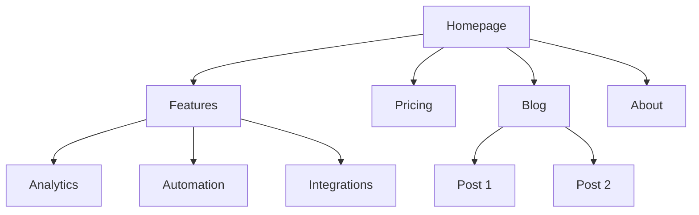
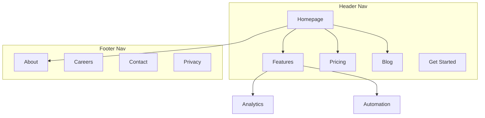

# Site Architect

## Before Starting

- Check if `product-marketing-context.md` exists in the workspace — read it first
- Gather required context from the user if not already available
- Understand the page/product/audience before making recommendations

## Workflow

### Before Planning

**Check for product marketing context first:**
If `.agents/product-marketing-context.md` exists (or `.claude/product-marketing-context.md` in older setups), read it before asking questions. Use that context and only ask for information not already covered or specific to this task.

Gather this context (ask if not provided):

### 1. Business Context
- What does the company do?
- Who are the primary audiences?
- What are the top 3 goals for the site? (conversions, SEO traffic, education, support)

### 2. Current State
- New site or restructuring an existing one?
- If restructuring: what's broken? (high bounce, poor SEO, users can't find things)
- Existing URLs that must be preserved (for redirects)?

### 3. Site Type
- SaaS marketing site
- Content/blog site
- E-commerce
- Documentation
- Hybrid (SaaS + content)
- Small business / local

### 4. Content Inventory
- How many pages exist or are planned?
- What are the most important pages? (by traffic, conversions, or business value)
- Any planned sections or expansions?

---

### Visual Sitemap Output (Mermaid)

Use Mermaid `graph TD` for visual sitemaps. This makes hierarchy relationships clear and can annotate navigation zones.

### Basic Hierarchy

### With Navigation Zones

**For more Mermaid templates**: See [references/mermaid-templates.md](references/mermaid-templates.md)

---

### Output Format

When creating a site architecture plan, provide these deliverables:

### 1. Page Hierarchy (ASCII Tree)
Full site structure with URLs at each node. Use the ASCII tree format from the Page Hierarchy Design section.

### 2. Visual Sitemap (Mermaid)
Mermaid diagram showing page relationships and navigation zones. Use `graph TD` with subgraphs for nav zones where helpful.

### 3. URL Map Table

| Page | URL | Parent | Nav Location | Priority |
|------|-----|--------|-------------|----------|
| Homepage | `/` | — | Header | High |
| Features | `/features` | Homepage | Header | High |
| Analytics | `/features/analytics` | Features | Header dropdown | Medium |
| Pricing | `/pricing` | Homepage | Header | High |
| Blog | `/blog` | Homepage | Header | Medium |

### 4. Navigation Spec
- Header nav items (ordered, with CTA)
- Footer sections and links
- Sidebar nav (if applicable)
- Breadcrumb implementation notes

### 5. Internal Linking Plan
- Hub pages and their spokes
- Cross-section link opportunities
- Orphan page audit (if restructuring)
- Recommended links per key page

---
